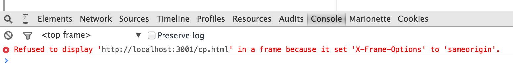

# Framebusting

A simple demo to show the use of `X-Frame-Options` in helping prevent clickjacking.

## Install

Install framebusting with `npm install`

Fire up the good server with `node index.js 3001`

Fire up the bad server with `node index.js 3002`

Browse to [The Good Frame page](http://localhost:3001/good-frame.html) then browse to [The Bad Frame page](http://localhost:3002/bad-frame.html).

## Results

Pages on the good site are served up with a `X-Frame-Options` header set to `sameorigin`.

When the bad site tried to load a page from the good site in a frame, to clickjack, the browse prevents this.

The good site can still load its own pages into frames.

## What the code?!

This is a Hapi app with three routes:

- A regular page on the good site
- A frame page on the good site
- A frame page on the bad site

Running the application twice, on different ports, allows us to act like two different sites.

The different port numbers is enough to make browsers consider them to be different.

Note: IE doesn't.
